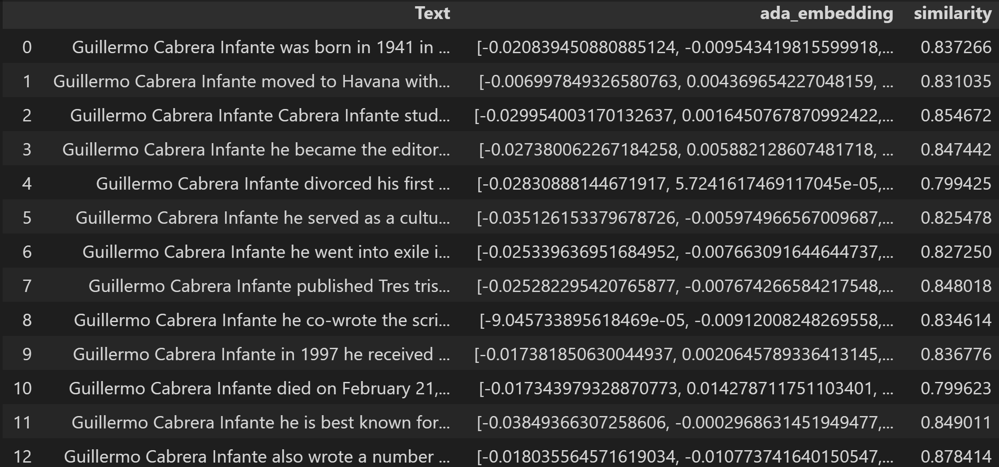
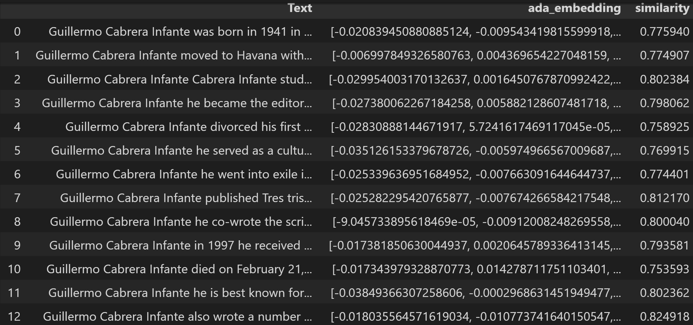

# Use GPT-3 to extract embedded vectors from a list of facts and from a query. Perform a semantic search to find which facts are relevant to the query.

## INITIAL THOUGHTS.

In the repo ‘gpt3_parse_wikipedia_extract_facts_jupyter_test01’ a list of relevant facts were obtained from a Wikipedia page. The idea is to use these facts to be added to a query, depending on how relevant they might be to answer the query with better accuracy.

To do this first, all the embedded vectors for each of the facts are obtained and stored in a csv file. Then the embedded vector of the query is obtained. Since queries tend to be quite verbose a list of keywords is first extracted from the query and then the embedded vector is obtained from the keywords.

Then the embedded vector of the query is compared with each of the embedded vector of the fact list to obtain a measure of similarity. This then can be used to be added to the query as a context.

## DESCRIPTION OF THE PROGRAM

In the first cell the function ‘get_embedding’ is defined, I ended up defining this function instead using the one in OpenAI utils because this would require to install many dependencies.

Then a dataframe is created to include the text of each fact and its embedded vector calculated using the function ‘get_embedding’. This dataframe is saved in a csv file.

The second cell starts defining the function ‘cosine_similarity’ (OpenAI utils have one but require the installation of many dependencies) to calculate the similarity between two vectors.

Then a query is defined and a set of keywords is extracted using the OpenAI Completion API with the prompt that was prepared for this matter. Once the keywords was obtained then the embedded vector for this keywords was created using ‘get_embedding’ function.

Following the dataframe containing the facts and its embeddings is loaded and a loop is done across all the rows of this dataframe comparing each vector embedding with the vector embedding obtained from the query. This is done using the function ‘cosine_similarity’. The result is stored in a new column of the dataframe named ‘similarity.

## RESULTS

Below is a partial result of the resulting dataframe with the similarity scores obtained for the query: ‘Tell me a Latin American writer’.

Compare this with the one obtained as with the query" 'Tell me a Chínese writer'.

As you can see the score from the second query are less than the first one as expected.

## FINAL THOUGHTS

One thing to notice in the results is that the second one produces lower levels of similarities but, they are not as low as we could expect. This seams to be because the term writer tend to group together writers of any nationality. This could produce false positives and the only way to overcome this is to use a higher threshold (maybe 0.85) to determine the cut for found similarities. This is a topic that requires more investigation.

Extracting keywords from the query before creating the embedded vector could produce better results but this needs more investigation because getting the embedding vector directly from the query produces good results too. In any case a modified version of this algorithm in which keywords are obtained from each fact, to produce the embedded vectors from them, could be explored to see if this improved the overall reliability.

Finally the results need to be stored in a database. In further projects I’ll investigate some possibilities for this

